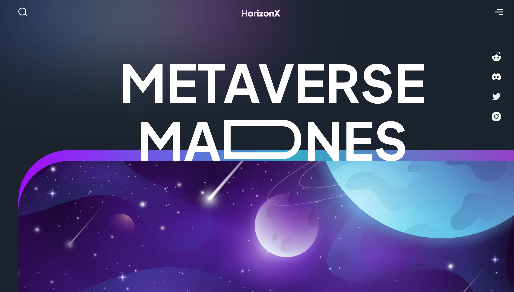

# 🌌 HorizonX&#x20;

Welcome to **HorizonX** — a sleek, modern metaverse landing page built with **Next.js**, **Tailwind CSS**, and **Framer Motion** for smooth animations and an immersive experience.

## 🖼️ Preview

## 🚀 Tech Stack

- **Next.js** — For server-side rendering and routing.
- **Tailwind CSS** — For fast, responsive styling.
- **Framer Motion** — For clean, smooth animations.

## 🎯 Features

- **Fully responsive** design.
- **Smooth animations** using Framer Motion.
- **SEO optimized** with Next.js.

## 📁 Project Setup

1. **Clone the repo:**

2. **Install dependencies:**

3. **Run development server:**

   Open [http://localhost:3000](http://localhost:3000) to view the page.

## 🎨 Design Inspiration

Inspired by futuristic UI designs with a clean, immersive feel — perfect for a modern Metaverse project.

## 🔗 Links

- **Live Demo:** [https://metaverse-landing-vert.vercel.app/](https://metaverse-landing-vert.vercel.app/)

## 🤝 Contributing

Feel free to fork this project and submit pull requests. Suggestions and ideas are welcome!

## 🛠️ Author

**Anisubhra Sarkar**

- [LinkedIn](https://www.linkedin.com/in/anisubhrasarkar/)
- [GitHub](https://github.com/Anisubhra)
- [Twitter](https://x.com/anisubhrasarkar)

---

⭐️ If you like this project, feel free to star the repo!

